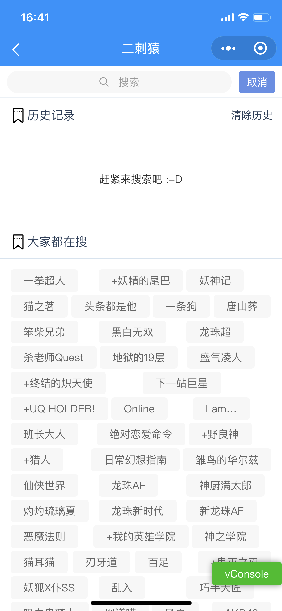

##  [动漫之家](http://m.dmzj.com)小程序

#### 我就想问你,吃蝙蝠能上天???


#### [开发相关](./package.json)

```javascript
{
    "@tarojs/taro": "2.0.2", 
    "@tarojs/mobx": "2.0.2",
    "@kevinwolf/formal": "^0.1.3", 	//form验证组件
    "yup": "^0.28.1"				//提供form验证逻辑
    "axios-hooks": "^1.9.0", 		//提供axios hook
    "dayjs": "^1.8.20",				//日期格式化工具
    "lodash-es": "^4.17.15",		//函数工具集
    "mobx": "4.8.0",				//数据管理
    "mobx-sync": "^2.1.2",			//本地存储
    "query-string": "^6.10.1",		//url解析
    "regenerator-runtime": "0.11.1",//解决taro 2.0.2异步编程报错(issue解决方案)
    "taro-axios": "^0.7.0",			//taro请求工具
    "taro-list": "^1.0.6",			//提供列表展示上拉刷新/下拉加载
    "taro-ui": "^2.2.4",			//官方ui库
}
```


#### 部分接口

| 接口名称 |                             请求                             |
| :------: | :----------------------------------------------------------: |
|   登录   |           https://user.dmzj.com/loginV2/m_confirm            |
|   推荐   | http://v3api.dmzj.com/v3/recommend.json?channel=ios&version=3.0.2 |
|   更新   | http://v3api.dmzj.com/latest/100/0.json?channel=ios&version=3.0.2 |
|   分类   | http://v3api.dmzj.com/0/category.json?channel=ios&version=3.0.2 |
|   排行   | http://v3api.dmzj.com/rank/0/0/0/0.json?channel=ios&version=3.0.2 |
|   专题   | http://v3api.dmzj.com/subject/0/0.json?channel=ios&version=3.0.2 |
| 搜索热词 | http://v3api.dmzj.com/search/hot/0.json?channel=ios&version=3.0.2 |
| 搜索提示 | http://v3api.dmzj.com/search/fuzzy/0/N.json?channel=ios&version=3.0.2 |
| 搜索结果 | http://v3api.dmzj.com/search/show/0/N/0.json?channel=ios&version=3.0.2 |
| 猜你喜欢 | http://v3api.dmzj.com/recommend/batchUpdate?category_id=50&channel=ios&uid=110332672&version=3.0.2 |
| 我的订阅 | http://v3api.dmzj.com/recommend/batchUpdate?category_id=49&channel=ios&uid=110332672&version=3.0.2 |
| 其余地址 |         [manga-api.ts](./src/contexts/manga-api.ts)          |


#### 效果图展示

```nginx
#因为原网站跨域问题 H5写着写后期没做兼容.加之防盗链关系 小程序Image组件没法伪造Referer.固需要设置代理

#nginx 设置:

server {
    listen       80;    ## 该端口为storage.conf中的http.server_port相同
    server_name  img.javautil.top;
    location / {
            proxy_pass  http://imgsmall.dmzj.com;
            proxy_redirect     off;
            proxy_set_header   Referer          http://imgsmall.dmzj.com/;
            proxy_set_header   Host             imgsmall.dmzj.com;
            proxy_set_header   X-Real-IP        $remote_addr;
            proxy_set_header   X-Forwarded-For  $proxy_add_x_forwarded_for;
     }
}


```


|          漫画详情          |        漫画预览         |          主页推荐          |
| :------------------------: | :---------------------: | :------------------------: |
|  |   |  |
|          主页更新          |        主页搜索         |          个人中心          |
|  |  |  |


### taro 踩坑&吐槽

```text

解决提示Function问题: "regenerator-runtime": "0.11.1",
解决lodash 函数now报错: 入口文件添加global.Date = Date
map函数结构工具竟然不提示错误,编译显示index.scss问题!!!
分页组件无法复用 mobx/reducer两种形式都不行.暂时放弃.更新taro-cli 2.0.3没法使用
taro3.0 上手更简单,后期可能会更新


 
```
